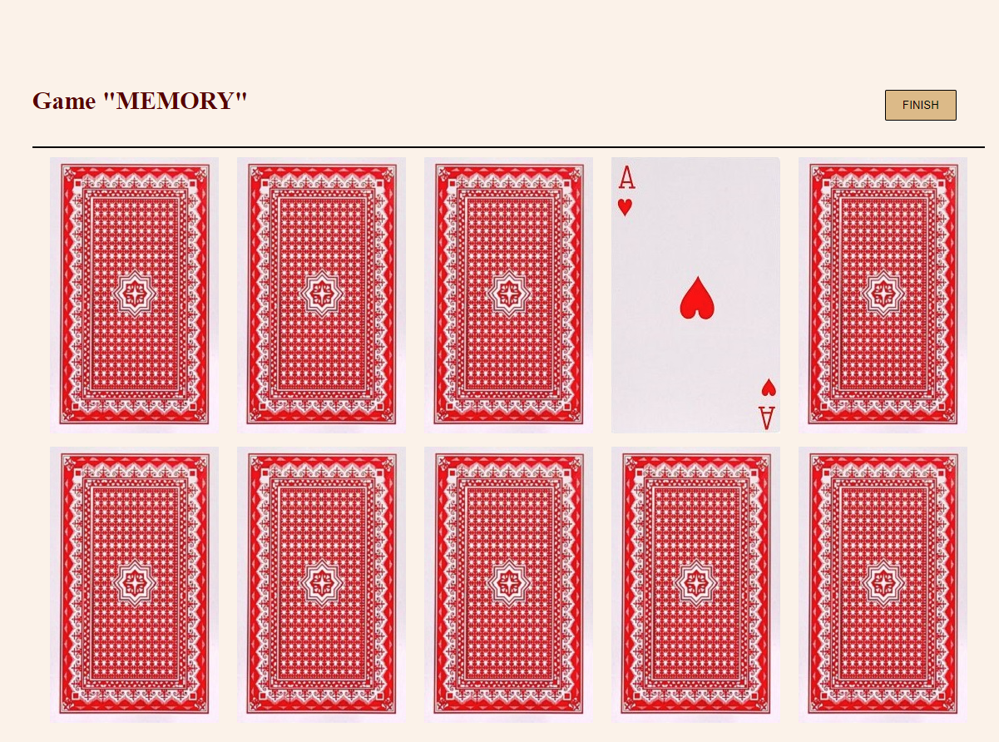

ИГРА "MEMORY"

Правила игры:

На столе 5 пар игральных карт.
Игра начинается при нажатии на кнопку START. 
Цели игры - открыть все карты.

Открыть можно не более 2-х карт одновременно. Если открытые карты совпадают, то они остаются открытыми.
Если открытые карты не совпадают, то они закрываются автоматически через 2 секунды. Игрок побеждает в случае когда все пары карт открыты.
Игрок также имеет возможность оперативно завершить игру по своему желанию нажав на кнопку FINISH.

